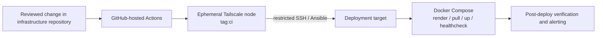

# External deployment strategy

## Summary

This draft replaces the coupling between an application host and its
self-hosted GitHub Actions runner. Docker Compose remains the workload runtime,
but a GitHub-hosted workflow becomes the external controller that reaches a
deployment target privately through Tailscale.

## Key points

- Store Compose definitions, deployment playbooks, and host configuration in
  the infrastructure repository.
- Use GitHub-hosted Actions for validation and deployment orchestration.
- During a deployment job, the runner joins the tailnet as an ephemeral
  `tag:ci` identity using workload identity federation.
- ACLs grant `tag:ci` only the destination-specific SSH/Ansible access that a
  deployment needs. It must not receive general home-network or administrator
  access.
- Ansible renders or synchronizes the deployment content into a stable,
  host-owned path and executes Docker Compose on the target host. Docker and
  bind-mount commands must not run on the GitHub-hosted runner itself.
- Images should be built and published before deployment where practical;
  avoid building production images ad hoc on the application target.
- The first external workflow is a no-op connectivity check. A non-critical
  service is the first deployment target. Stateful workloads move only after
  backup and restore drills succeed.

## Control flow

## Boundaries

| Component | Responsibility | Must not do |
| --- | --- | --- |
| GitHub-hosted runner | Validate, orchestrate and audit deployments | Run target Docker commands locally or retain tailnet access after the job |
| `tag:ci` | Short-lived, least-privileged network identity | Reach arbitrary LAN devices, routers, databases, or admin workstations |
| Ansible | Prepare host and render stable deployment inputs | Become an unmanaged replacement for application configuration |
| Docker Compose | Run declared containers, networks, volumes, and healthchecks | Be manually edited on the production host |
| Target host | Execute the rendered Compose deployment | Host its own normal CI control plane |

## Links

- [[target-network-and-operations-topology]]
- [[_raw/conversations/2026-08-18--atlas-tailscale-and-external-deploy-control]]
- [[_raw/conversations/2026-08-18--home-network-topology-first]]
- [[_raw/research/european-cloud-migration-atlas--shallow/report]]

## Open questions and contradictions

- Confirm whether Atlas is only a transitional target or must support this
  external deployment path before cloud migration.
- Specify the exact Tailscale ACL policy, deployment Unix account, sudo model,
  and secret-rendering strategy.
- Define image registry, image signing or provenance requirements, and rollback
  behavior.
- The current deployment workflow runs on Atlas and uses its Docker socket;
  replacing it requires a dedicated remote deployment playbook rather than a
  direct move of the existing script to a GitHub-hosted runner.
