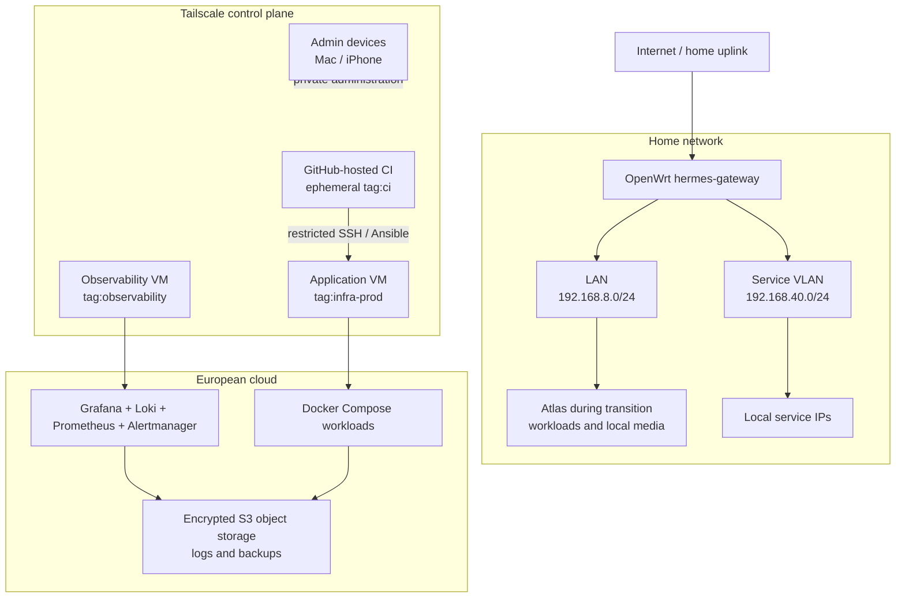

# Target network and operations topology

## Summary

This draft describes a target topology for a stable, private-by-default home
and cloud infrastructure. It is a decision aid, not a description of the
current live network. Validate the live topology and recovery path before
changing router, DNS, Tailscale, or workload configuration.

The design keeps home routing separate from cloud workloads. Tailscale is the
private control plane between trusted clients, managed hosts, and a
least-privileged CI identity. Docker Compose remains the workload runtime;
GitHub Actions is an external deployment controller rather than a service
running on the target host.

## Target topology

## Principles

1. **Management before services.** A tested management path must exist before
   service, DNS, VLAN, or deployment changes: client -> Tailscale -> router or
   direct host -> target.
2. **One network role per component.** OpenWrt remains the home router and the
   only home subnet router. Cloud hosts are direct Tailscale nodes; the cloud
   does not extend the home VLANs.
3. **External deployment control.** GitHub-hosted Actions joins the tailnet as
   an ephemeral `tag:ci` node. Its ACL grants only the SSH/Ansible path required
   for a deployment target. A workload host is never its own CI controller.
4. **Observability is independent.** Central logs and alerts run outside the
   workload host. Grafana Alloy collects Docker stdout/stderr and journald;
   Loki stores logs; Grafana queries them; Prometheus and Alertmanager provide
   metrics and alerts.
5. **Private by default.** Administrative interfaces, Loki, Grafana,
   Prometheus, and SSH are reachable through Tailscale only. Public ingress is
   a separate, explicitly designed concern.
6. **Recoverability over premature HA.** Start with reproducible provisioning,
   encrypted backups, and restore drills. Do not introduce a Proxmox cluster,
   Ceph, or distributed logging system until a measured need exists.

## Roles and boundaries

| Component | Intended responsibility | Explicit boundary |
| --- | --- | --- |
| `hermes-gateway` | Home routing, DHCP/DNS, firewall, Tailscale subnet routes | Not a cloud router or application host |
| Atlas | Transitional local workloads and local media | Not the long-term CI control plane |
| Cloud application VM | Docker Compose application workloads | No public management ports; no home-VLAN extension |
| Cloud observability VM | Central logging, metrics, dashboards, alerts | Separate from application VM failure domain |
| S3-compatible object storage | Encrypted backup and Loki object data | Does not replace restore verification |
| `tag:ci` | Short-lived deployment identity | Only destination-specific, minimum ACL access |

## Change order

1. Capture and validate the current physical and logical topology, including a
   recovery route that does not depend on DNS or Tailscale.
2. Inventory current containers and durable volumes. Classify each workload as
   keep, migrate, archive, or retire; preserve data before any retirement.
3. Restore and prove remote management access to Atlas through the intended
   router-subnet path; repeat after a router reboot.
4. Establish the ephemeral `tag:ci` path with a no-op SSH/Ansible check only.
5. Deploy independent observability and define log redaction, retention, alert
   routing, and backup verification.
6. Introduce remote deployment of a non-critical Compose workload.
7. Migrate stateful and privacy-sensitive workloads only after backup and
   restore drills succeed.

## Open questions and contradictions

- The documented home topology is not evidence of the live router wiring,
  routes, Tailscale ACL policy, device tags, or route approvals; record these
  before treating the diagram as a migration baseline.
- Confirm whether Atlas should be reachable only through OpenWrt subnet routes
  or also as a direct Tailscale node.
- Decide the cloud provider, EU versus Germany-specific data residency, public
  ingress requirements, and the scope of Mail Ops / financial data in cloud
  logging and backups.
- Inventory which current containers and volumes have an active purpose;
  PostgreSQL is currently not considered a required target workload.
- Choose Alertmanager's notification channel and explicit retention limits.

## Links

- [[_raw/conversations/2026-08-18--home-network-topology-first]]
- [[_raw/conversations/2026-08-18--atlas-tailscale-and-external-deploy-control]]
- [[_raw/conversations/2026-08-18--topology-before-workload-inventory]]
- [[_raw/research/proxmox-homelab-architecture--shallow/report]]
- [[_raw/research/european-cloud-migration-atlas--shallow/report]]
- [[_raw/research/central-logging-stack--shallow/report]]
